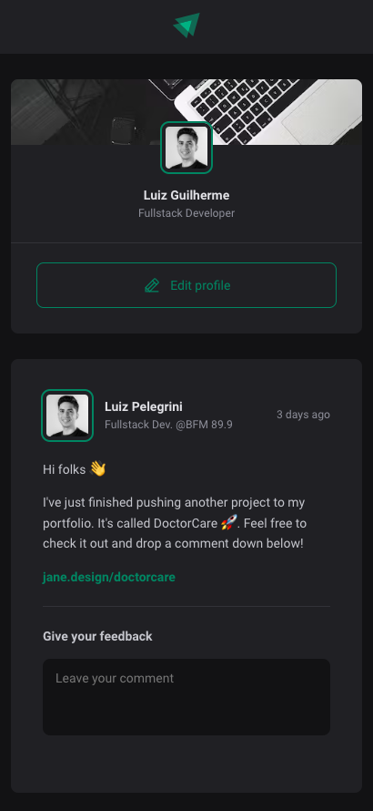
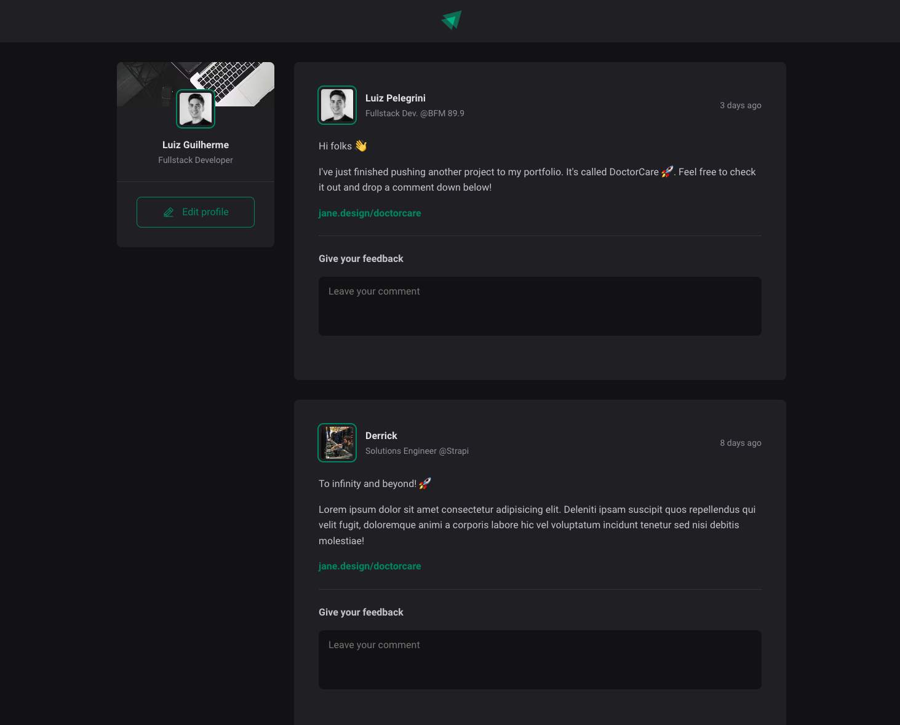

<h1 align="center">React js</h1>

  

## About
Training my skills with a React project where the user is able to see a set of posts, comment on each one of them and add unlimited likes to different comments.

## ✨ Live project
<a href="https://luizpelegrini.github.io/reactjs-fundamentals/" target="_blank">https://luizpelegrini.github.io/reactjs-fundamentals</a>

 

### 🧑‍💻 What I learn
* Using CSS Modules in React.
* Why React uses the concept of <b>immutability</b> when handling component state.
* Why the attribute `key` is needed when displaying a list of components, and why the array index is not a good candidate for it.
* HTML tag `<time>` and its attributes.
* `date-fns` package for handling dates in Javascript
* Deploying project to Github using `gh-pages` package

 

---

 

    <b>Mobile</b>

  

    <b>Desktop</b>

    

 

---

 

## 🚀 How to run:

- Clone this repository.
- Run `npm install`.
- Run `npm run dev` to start the local server.